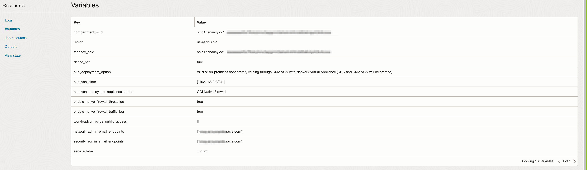
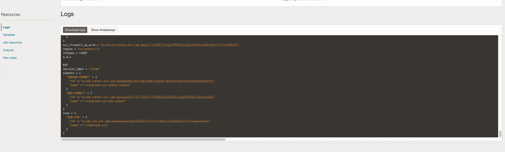
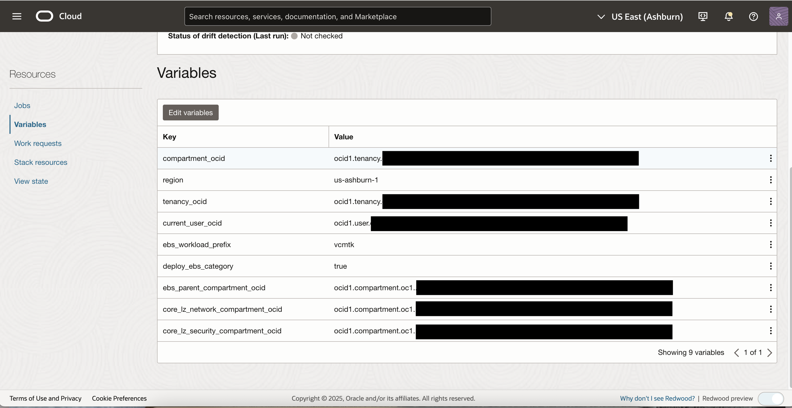
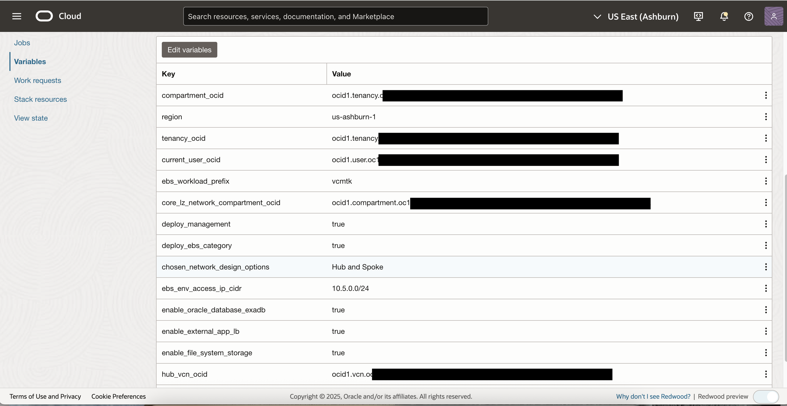
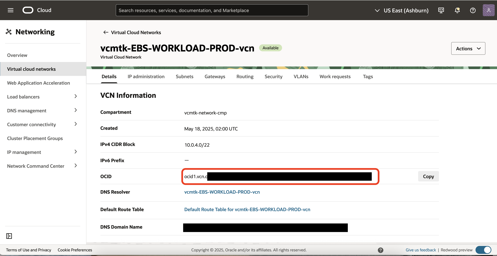
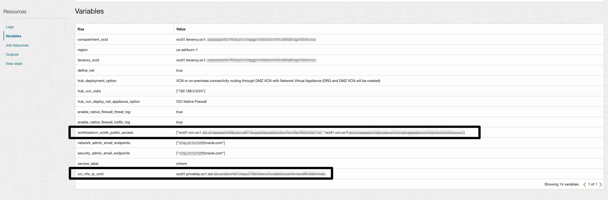
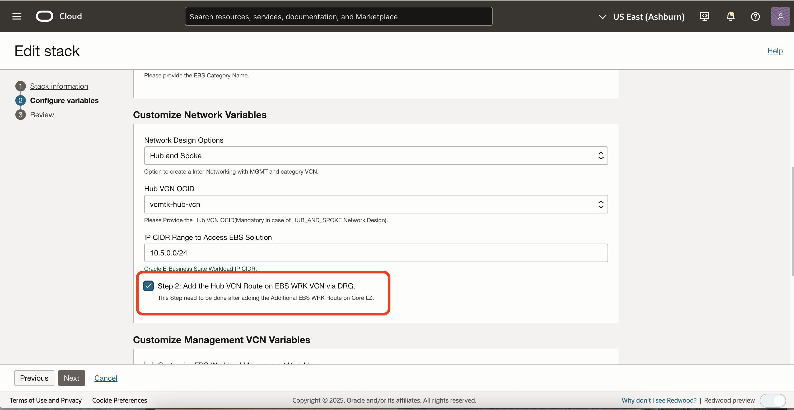
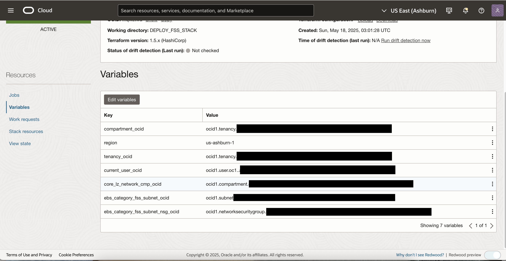

# OCI Landing Zone E-Business Suite (EBS) via Cloud Manager - Deployment Guide:

This document provides information regarding deployment of E-Business Suite using Cloud Manager on top of an existing Core Landing Zone with network firewall.

## Table of Contents

1. [EBS Workload Deployment Variables](#ebs1)
    1. [EBS IAM Extension Variables](#ebs1a)
    1. [EBS Network Extension Variables](#ebs1b)
    1. [EBS FSS Extension Variables](#ebs1c)
1. [EBS Workload Deployment](#ebs2)
    1. [Deploy the Core Landing Zone Blueprint](#ebs2a)
    1. [Deploy the EBS Workload IAM Extension](#ebs2b)
    1. [Deploy the EBS Workload Network Extension](#ebs2c)
    1. [Add EBS Workload VCN Routes on Core Landing Zone Hub VCN](#ebs2d)
    1. [Add Core Landing Zone Hub VCN Route on EBS Workload VCNs](#ebs2e)
    1. [Deploy EBS Workload FSS Extension](#ebs2f)
    1. [Deploy EBS Cloud Manager from the Marketplace](#ebs2g)
    1. [Deploy Application Load Balancer](#ebs2h)
    1. [Add Rule on Hub NSG and Add NSG on Load Balancer](#ebs2i)
    1. [Network Firewall Policy](#ebs2j)
    1. [Update Firewall on the Cloud Manager Instance](#ebs2k)
    1. [Access Cloud Manager](#ebs2l)

## EBS Workload Deployment Variables

### EBS IAM Extension Variables

#### IAM Extension Default Values

| Variable Name | Description | Type | Default Value |
|---------------|-------------|------|---------------|
| ebs\_workload\_prefix | A unique identifier to prefix stack resources. | string | "cmwrk" |
| deploy\_ebs_mgmt | Checkbox to deploy EBS Management compartment, group and policies. | boolean | true |
| deploy\_ebs\_category | Checkbox to deploy EBS Category compartment, group and policies. | boolean | false |
| ebs\_category | EBS Category name. | string | "prod" |
| ebs\_compartment\_structure | Choose to deploy in the EBS compartment (single) or deploy Management and/or Category in separate (flexible) compartments. | string |"Single Compartment Deployment" |
| customize\_compartment\_names | Check to customize EBS compartment names. Default names are EBS-WORKLOAD, EBS-WORKLOAD-MGMT. | boolean | false |
| ebs\_workload\_compartment\_name | EBS Workload compartment name, where all EBS Workload resources are deployed. | string | "ebs-workload" |
| ebs\_mgmt\_compartment\_name | EBS Workload Management compartment name. | string | "ebs-management" |

### EBS Network Extension Variables

#### Network Extension Default Values

| Variable Name | Description | Type | Default Value |
|---------------|-------------|------|---------------|
| ebs\_workload\_prefix | A unique identifier to prefix the stack resources. | string | "cmwrk" |
| deploy\_ebs_mgmt | Checkbox to deploy EBS Management compartment, group and policies. | boolean | true |
| deploy\_ebs\_category | Checkbox to deploy EBS Category compartment, group and policies. | boolean | false |
| ebs\_category | EBS Category name. |string | "prod" |
| chosen\_network\_design\_options | Option to create inter-networking with Management VCN, Category VCN and Hub VCN. "Hub and Spoke" or "Standalone" | string | "Hub and Spoke" |
| define\_mgmt\_net | Check to customize EBS Workload networking resources variables. The EBS Workload networks resources uses default value. | boolean | false |
| enable\_file\_system\_storage | Enable the File System Storage (FSS) service. | boolean | false |
| enable\_external\_app\_lb | Deploy external LBaaS and application. | boolean | false |
| ebs\_workload\_mgmt\_vcn\_name | Name of EBS Workload Management VCN. | string | "ebs-management-vcn" |
| ebs\_workload\_mgmt\_vcn\_cidr | CIDR IP Block for EBS Workload Management VCN. By default, netmask /22 gives 1022 usable addresses; 128 addresses (126 usable) per subnet when using the maximum of seven subnets. | list(string) |"[\"10.0.0.0/22\"]" |
| ebs\_mgmt\_lb\_subnet\_name | Name for EBS Management load balancer subnet. | string | "ebs-mgmt-lb-subnet" |
| ebs\_mgmt\_app\_subnet\_name | Name for EBS Management application subnet. | string | "ebs-mgmt-app-subnet" |
| ebs\_workload\_category\_vcn\_cidr | CIDR IP Block for EBS Workload Category VCN. By default, netmask /22 gives 1022 usable addresses; 128 addresses (126 usable) per subnet when using the maximum of seven subnets. | list(string)| "[\"10.0.4.0/22\"]" |
| enable\_mgmt\_nat\_gateway | Whether or not to deploy the Management NAT gateway. | boolean | false |

### EBS FSS Extension Variables

#### FSS Extension Default Values

| Variable Name | Description | Type | Default Value |
|---------------|-------------|------|---------------|
| ebs\_workload\_prefix | A unique identifier to prefix the stack resources. | string | "cmwrk" |
| deploy\_ebs\_category | Checkbox to deploy EBS Category compartment, group and policies. | boolean | false |
| ebs\_category\_fss\_subnet\_ocid | Please provide the EBS Category FSS subnet OCID.| string | string | "" |
| ebs\_category\_fss\_subnet\_nsg\_ocid | Please provide the EBS Category FSS subnet NSG OCID. | string | "" |
| ebs\_category\_mount\_target\_name | Name for EBS Category FSS mount target. | string | "" |

## EBS Workload Deployment

You can deploy the solution via the OCI RMS service.

### Step 1: Deploy the Core Landing Zone Blueprint

1. Click to deploy the Core Landing Zone Blueprint: 
   

2. Accept terms, wait for the configuration to load.

3. Set the stack name you prefer.

4. Add the following variable values:
   

5. Click on run apply and wait for 35-40 minutes for Core Landing Zone Blueprint provisioning.

6. Once provisioning is done, **note down the network firewall forwarding IP OCID** from the output section:
   

### Step 2: Deploy the EBS Workload IAM Extension

1. Click to deploy the EBS Workload IAM Extension: 
   

2. Accept terms, wait for the configuration to load.

3. Set the working directory to "DEPLOY\_IAM\_EXTENSION".

4. Set the stack name you prefer.

5. Add the following variable values:
   

6. Click on run apply and wait for five minutes for EBS Workload IAM Extension provisioning.

### Step 3: Deploy the EBS Workload Network Extension

1. Click to deploy the EBS Workload Network Extension: 
   

2. Accept terms, wait for the configuration to load.

3. Set the working directory to "DEPLOY\_NETWORK\_EXTENSION".

4. Set the stack name you prefer.

5. Add the following variable values:
   

6. Click on run apply and wait for five minutes for EBS Workload Network Extension provisioning.

7. Note down the EBS Workload Management and Category VCN OCID values:
   

   

### Step 4: Add EBS Workload VCN Routes on Core Landing Zone Hub VCN

1. Go to the Step 1 stack.

2. Edit the stack.

3. Add the following variable values (EBS Workload VCN OCID from step 3.7 and Network Firewall Forwarding IP OCID From step 1.6 ):
   

4. Click on run apply and wait for five minutes.

### Step 5: Add Core Landing Zone Hub VCN Route on EBS Workload VCNs

1. Go to the Step 3 stack.

2. Edit the stack.

3. Select the option "Step 2: Add the Hub VCN Route on EBS Workload VCN:
   

4. Click on run apply and wait for five minutes.

### Step 6: Deploy EBS Workload FSS Extension

1. Click to deploy the EBS Workload FSS Extension: 
   

2. Accept terms, wait for the configuration to load.

3. Set the working directory to "DEPLOY\_FSS\_EXTENSION".

4. Set the stack name you prefer.

5. Add the following variable values:
   

6. Click on run apply and wait for five minutes.

### Step 7: Deploy EBS Cloud Manager from the Marketplace

1. Follow the instructions to [Create Oracle E-Business Suite Cloud Manager Compute Instance](https://docs.oracle.com/cd/E26401_01/doc.122/f35809/T679330T679339.htm#T679473) and [Configure Oracle E-Business Suite Cloud Manager Compute Instance](https://docs.oracle.com/cd/E26401_01/doc.122/f35809/T679330T679339.htm#T680521). You should use these following variable values.

| Variable Name | Value |
|---------------|-------|
| Step 9b) Compartment Name | clzwrk-ebs-management |
| Step 9f-ii) Select a Virtual Cloud Network | clzwrk-ebs-management-vcn |
| Step 9f-iv) Select a subnet | clzwrk-ebs-mgmt-app-subnet |
| Step 9f-vi-ii) Use network security groups | clzwrk-ebs-mgmt-app-nsg |

2. Once the Cloud Manager is provisioned, attach the NSG "clzwrk-ebs-mgmt-lbaas-nsg" on Load balancer demolbaas1 and demolbaas2.

3. Note down the Cloud Manager URL.

### Step 8: Deploy Application Load Balancer

1. From the main navigation menu in the Oracle Cloud console, go to Networking and then click Load Balancers.

2. Choose a compartment "\<prefix\>-network-cmp", and then click Create Load Balancer.

3. Add these details:
   - Enter a name for the load balancer.
   - Choose Public visibility type.
   - Choose Ephemeral IP Address.
   - Choose the total bandwidth for the load balancer. The default is 10 Mbps, which should be sufficient.
   - Choose VCN "\<prefix\>-hub-vcn" and subnet "\<prefix\>-hub-vcn-web-subnet".

4. Click Next.

5. Specify a load balancer policy. The default is Weighted Round Robin.

6. Specify Backend Server Compartment "\<prefix\>-ebs-management"

7. Click Add Instances.

8. Select Cloud Manager instances in the load balancer backend set, then click Add Selected Instances.

9. In the Specify Health Check Policy section, use the default values. Because we are load balancing a web server, choose HTTP protocol and port 8081.

10. Change the URL path (URI) to /cm/ui/index.html

11. Change the Response body regex to "\*" to match all expressions.

12. Click Next.

13. On the Configure Listener page, choose HTTPS as the type of traffic that your listener handles.

14. Use port 443, and click next.

15. Provide a necessary [SSL certificate](https://docs.oracle.com/en-us/iaas/Content/Balance/Tasks/create_certificate.htm).

16. Click Next.

17. Click Submit.

After the load balancer is created, you are redirected to the details page. There, you can get the public IP address of the load balancer.

### Step 9: Add Rule on Hub NSG and Add NSG on Load Balancer

1. From the main navigation menu in the Oracle Cloud console, go to Networking and select Virtual cloud networks.

2. Specify the Compartment name "\<prefix\>-network-cmp".

3. Select "\<prefix\>-hub-vcn". 

4. Go to Security and select "app-load-balancer-nsg" NSG.

5. Go to Security Rules and click on Add Rules.

6. Select Egress in Direction, CIDR in Destination Type, 10.0.0.0/22 in Destination, TCP in Protocol and 8081 in Destination Port Range.

7. Click on Add.
   
8. From the main navigation menu in the Oracle Cloud Console, go to Networking and then click Load Balancers.
   
9. Choose a compartment "\<prefix\>-network-cmp", and select Load Balancer.

10. Go to Details, Edit the NSG section and select "app-load-balancer-nsg" from drop-down menu and save changes.

### Step 10: Network Firewall Policy

By default, Network Firewall Policy is "reject all traffic". Change the Network Firewall Policy to accept port 8081 traffic from Hub VCN and EBS Workload VCN.

1. From the main navigation menu in the Oracle Cloud console, go to Identity and Security and select Network Firewall.

2. Specify the compartment name "\<prefix\>-network-cmp".

3. Select the Network Firewall Policy "\<prefix\>-oci-ebs-cm-firewall-policy".

4. Select the option Clone policy.

5. Provide the name for the policy and then select Create Network Firewall Policy.

6. Go to Network Firewall Policies and select your policy.

7. Go to Security Rules and delete the default "reject-all-rule" rule.

8. Create a new security rule.

9. On Source Address, Create Address list:

   >HUB      192.168.0.0/24 
   >SPOKE1   10.0.0.0/22 
   >SPOKE2   10.0.4.0/22 

10. For Source Address, select HUB.

11. For Destination address, select SPOKE1 and SPOKE2.

12. Select Any application.

13. Go to Services and create service list.

14. Provide the service list name; select TCP as protocol and 8081 as port.

15. Select any URL.

16. Specify "Allow Traffic" on Rule action.

17. Specify "First Rule in list".

18. Create security rule.

19. Navigate to Network Firewall page to update the Network Firewall Policy.

20. Edit the Network firewall instance.

21. Select the new policy from the drop-down menu.

22. Verify all information and click Save changes.

23. Policy update takes up to 10 minutes. You can track your work request within the Network Firewall resources page.

### Step 11: Update Firewall on the Cloud Manager Instance

1. Login to Cloud Manager instance.

2. Switch to root user.

   >*sudo su -*

3. Add the following firewall rules:

   >*firewall-cmd --zone=public --add-rich-rule='rule family=ipv4 source address=10.0.0.0/22 port port=8081 protocol=tcp accept' --permanent*

   >*firewall-cmd --zone=public --add-rich-rule='rule family=ipv4 source address=192.168.0.0/24 port port=8081 protocol=tcp accept' --permanent*

4. Restart the firewall service.

   >*sudo systemctl restart firewalld*

5. Verify the firewall rules.

   >*sudo firewall-cmd --list-all*

For more information, please see [Manually Configure Firewall When Using Oracle HTTP Server or an On-Premises Load Balancer as the Web Entry Point](https://docs.oracle.com/cd/E26401_01/doc.122/f35809/T679330T679344.htm#cmg_postprov_firewall)

### Step 12: Access Cloud Manager

To access Cloud Manager, login using the application load balancer public IP address. If you manage a DNS service, you can register the public IP address for your convenience. Optionally, add the Cloud Manager name and public IP address to your local computer hosts file. Follow the instructions at the very bottom of [Log in to Oracle E-Business Suite Cloud Manager](https://docs.oracle.com/cd/E26401_01/doc.122/f35809/T679330T679339.htm#T679483) to perform this task.

