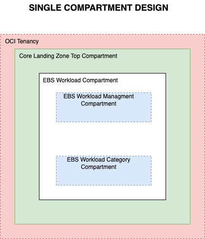
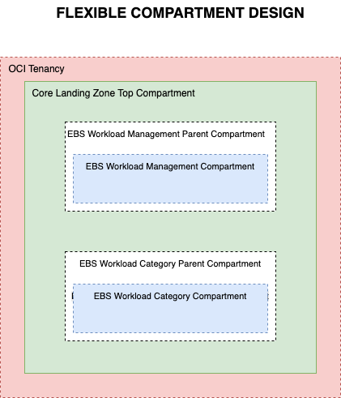
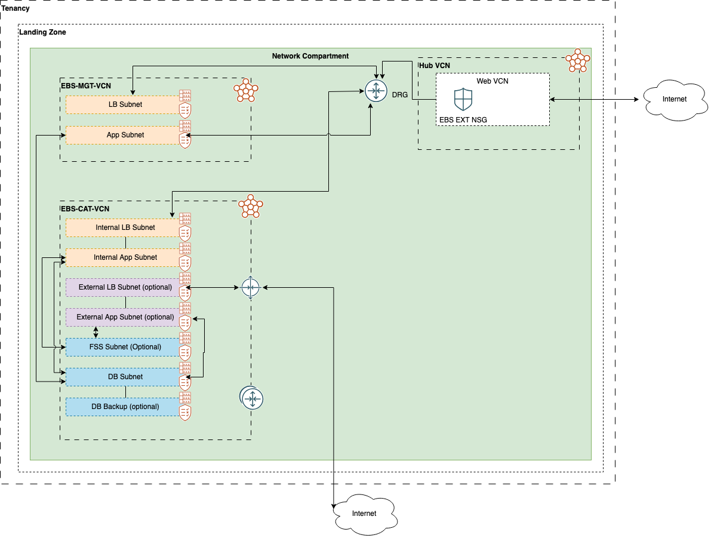

# E-Business Suite Workload Extensions for Core Landing Zone

Welcome to the [OCI Landing Zones (OLZ) Community](https://github.com/oci-landing-zones)! OCI Landing Zones simplify onboarding and running on OCI by providing design guidance, best practices, and pre-configured Terraform deployment templates for various architectures and use cases. These enable customers to easily provision a secure tenancy foundation in the cloud along with all required services, and reliably scale as workloads expand.

## Table of Contents

1. [Overview](#overview)
1. [Architecture](#architecture)
1. [Identity and Access Management](#iam)
1. [Network](#network)
1. [File System Storage](#storage)

## <a name="overview">Overview</a>

This EBS Workload repository provides three Core landing zone extensions that are required to provision an environment for deploying Oracle E-Business Suite (EBS) via Cloud Manager. The extensions set up IAM, networking, and security resources. Once the environment is ready, users are directed to OCI Marketplace to install Cloud Manager, which then deploys the EBS application.

Prerequisite: Deploy these extensions on an existing OCI Core Landing Zone foundation. 

## <a name="architecture">EBS Workload Architecture</a>

The EBS Workload extensions create a Workload compartment within the Core Landing Zone top compartment, that includes Management and Production compartments defined by the user. The extensions deploys all necessary resources like OCI IAM user groups, IAM policies, networking resources and security resources that are mandatory for EBS Cloud Manager. NOTE: EBS Workload extensions  only works on top of an existing Core Landing Zone deployment **with a network firewall**.

To support separation of duties and enable different admin teams to provision and manage the respective resources in their domain, each resource is provisioned with a separate extension: 

1. EBS Workload IAM extension
2. EBS Workload Network extension
3. EBS Workload File Storage Service (FSS) extension

### Architecture Diagram

Note: Configurations of the Application Load Balancer(ALB) and exposing EBS Workload Extensions to the internet via that ALB is the responsibility of the end users.

## <a name="iam">EBS Workload IAM Extension</a>

EBS Workload IAM Extension deploys the solutions to enforce segregation of duties and the least privilege principle by defining compartments, policies, groups and dynamic groups. Existing users can be optionally added to groups, but are not created. 

The segregation of duties concept is implemented by granting groups *manage* permissions over specific resources on specific compartments. At the same time, other groups are entitled narrower permissions on those same resources. 

For instance, network administrators are granted *manage* permission over the networking resources in the *Network* compartment. Other groups, like database administrators, are granted *read* permission on *virtual-network-family* in the *Network* compartment and *use* permission on *vnics*, *subnets* and *network-security-groups*, so the databases they provision can make proper use of the network. 

The IAM Extension deploys the following OCI resources:

1. EBS Workload Compartment
2. EBS User Groups
3. EBS Polices

### EBS Workload Compartment

For organization and access control purposes, resources created by the EBS Workload Extensions are grouped together logically using the OCI Compartment feature. The user can choose one of two deployment options: 

1. Single Compartment Deployment - The EBS Workload Management and EBS Workload Category compartments are deployed in a single parent EBS Workload compartment with an OCID provided by the user.
2. Flexible Compartment Deployment - The EBS Workload Management and EBS Workload Category compartments are deployed in different parent compartments with OCIDs provided by the user.

 

### EBS Workload User Groups

IAM user groups are used to govern or restrict access to resources via access control policies. The EBS Workload Extensions only support the tenancy **default domain**.

EBS Workload Extensions deploys two groups:

- **ebs-cat-admin**: Category Administrators is for EBS Administrator to manage each EBS Category, e.g. Production Administrators 

- **ebs-mgmt-admin**: Management Administrators is for EBS Cloud Manager Administrators to manage EBS Cloud Manager and EBS management utilities 

### EBS Workload Policies

The EBS Workload Extensions policies implement segregation of duties and follow least privilege across the different personas (groups). Segregation of duties is implemented by granting specific permissions to a single target group on a single target compartment. For example, only *Network Administrators* can manage the network family, and this is done only in the *Network* compartment.

Policies are attached at different compartments depending on the presence of an enclosing compartment. If EBS Workload Extensions compartments are deployed directly under the root compartment (thus no enclosing compartment), all policies are attached to the root compartment. If EBS Workload Extensions compartments are deployed within an enclosing compartment, some policies are attached to the root compartment, while some are attached to the enclosing compartment itself. This allows moving the EBS Workload Extensions compartments without the need to change policy statements. The policies at the root compartment are applied to resources at the tenancy level.

## <a name="network">EBS Workload Network Extension</a>

EBS Workload Network Extension deploys necessary OCI networking resources like VCNs, subnets, routing tables, NSGs and gateways on top of the Core Landing Zone networking resources. As part of design, this extension deploys two configurable VCNs (Management and Category) with corresponding subnets. Management VCN deploys two subnets and Category VCN deploys as many as seven user- customizable subnets. Two options are supported to interconnect EBS Workload networking resources with the Core Landing Zone networking resources: 

1. Hub and Spoke
2. Standalone

### Hub and Spoke Option

EBS Workload Management and EBS Workload Category VCNs (spokes) are connected to the Core Landing Zone Hub VCN via a DRG as peers. The Core Landing Zone Hub VCN provides connectivity to public internet and uses the DRG to enable private connectivity with an on-premises network as an additional spoke.

### Standalone Option

EBS Workload Management and EBS Workload Category VCNs are not connected to the Core Landing Zone Hub VCN.  As a user option, they may have public connectivity via an Internet gateway connected to the external load balancer subnet.

### Network Design

### Virtual Cloud Networks

EBS Workload Network extension creates two user customizable VCNs:

1. Management VCN \<workload-prefix\>-ebs-management-vcn
2. Category VCN \<workload-prefix\>-ebs-category-vcn

#### Management Environment VCN

Management VCN is where the EBS management environment networking resources are created and connected.

##### Subnets

Management VCN deploys two subnets:

1. Management Load Balancer Subnet: \<workload-prefix\>-ebs-mgmt-lb-subnet
2. Management Application Subnet: \<workload-prefix\>-ebs-mgmt-app-subnet

##### Gateway

Two gateways are deployed.

1. Service gateway: \<workload-prefix\>-ebs-mgmt-service-gateway 
Service gateway provides private and secure access to multiple Oracle Cloud services simultaneously from within a VCN or on-premises network via a single gateway without traversing the internet.

2. NAT gateway: \<workload-prefix\>-ebs-mgmt-nat-gateway 
NAT gateway provides internet access to resources that are behind a private subnet, without exposing them to incoming internet connections.

##### Network Security Groups

The following NSGs are deployed:

1. \<workload-prefix\>-ebs-mgmt-lbr-nsg
2. \<workload-prefix\>-ebs-mgmt-lbaas-nsg
3. \<workload-prefix\>-ebs-hub-lbr-nsg
4. \<workload-prefix\>-ebs-hub-cat-lbr-nsg

#### Category Environment VCN

Category VCN is where the EBS category environment networking resources are created and connected.

##### Subnets

Category VCN deploys as many as seven user customizable subnets:

| Subnet Name | Description | User Customizable | Naming Syntax |
|-------------|-------------|-------------------|------------------|
| Internal Load Balancer Subnet | Expose load balancer. | No | \<workload-prefix\>-ebs-category-int-lb-subnet |
| Internal Application Subnet | Expose application server. | No | \<workload-prefix\>-ebs-category-int-app-subnet |
| External Load Balancer Subnet | Expose load balancer for public access. | Yes | \<workload-prefix\>-ebs-category-ext-lb-subnet |
| External Application Subnet | Expose application server for public access.| Yes | \<workload-prefix\>-ebs-category-ext-app-subnet |
| FSS Subnet | Used for FSS resources. | Yes | \<workload-prefix\>-ebs-category-fss-subnet |
| Database Subnet | Used for database. | No | \<workload-prefix\>-ebs-category-db-subnet |
| Database Backup Subnet | In case of Exadata. | Yes | \<workload-prefix\>-ebs-category-db-backup-subnet |

##### Gateways

Two private gateways are deployed with an option for a public gateway.

1. Service gateway: \<workload-prefix\>-ebs-category-service-gateway 
Service gateway provides private and secure access to multiple Oracle Cloud services simultaneously from within a virtual cloud network (VCN) or on-premises network via a single gateway without traversing the internet.

2. NAT gateway: \<workload-prefix\>-ebs-category-nat-gateway 
NAT gateway: provides internet access to resources that are behind a private subnet, without exposing them to incoming internet connections.

3. Internet gateway: \<workload-prefix\>-ebs-category-internet-gateway 
An Internet gateway is optional and it is deployed when using the *Standalone* network option.

##### Network Security Groups (NSG)

The following NSGs are deployed.

1. \<workload-prefix\>-ebs-category-int-app-nsg
2. \<workload-prefix\>-ebs-category-int-lbaas-nsg
3. \<workload-prefix\>-ebs-category-ext-app-nsg
4. \<workload-prefix\>-ebs-category-ext-lbaas-nsg
5. \<workload-prefix\>-ebs-category-db-subnet-nsg
6. \<workload-prefix\>-ebs-category-db-backup-subnet-nsg
7. \<workload-prefix\>-ebs-category-fss-subnet-nsg

## <a name="storage">EBS Workload File Storage Service Extension</a>

This EBS Workload Extension deploys an FSS mount target on the Category environment and the snapshot policy. The mount target is attached to an FSS subnet with an FSS NSG. The mount target and FSS must be in the same Availability Domain, but once exposed to an OCI subnet the mount target is reachable from resources in a different Availability Domain.

